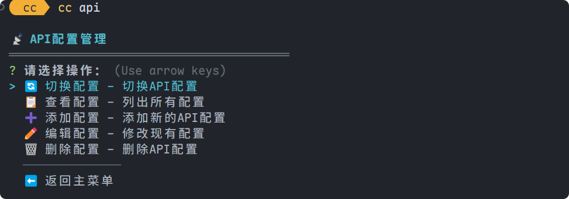
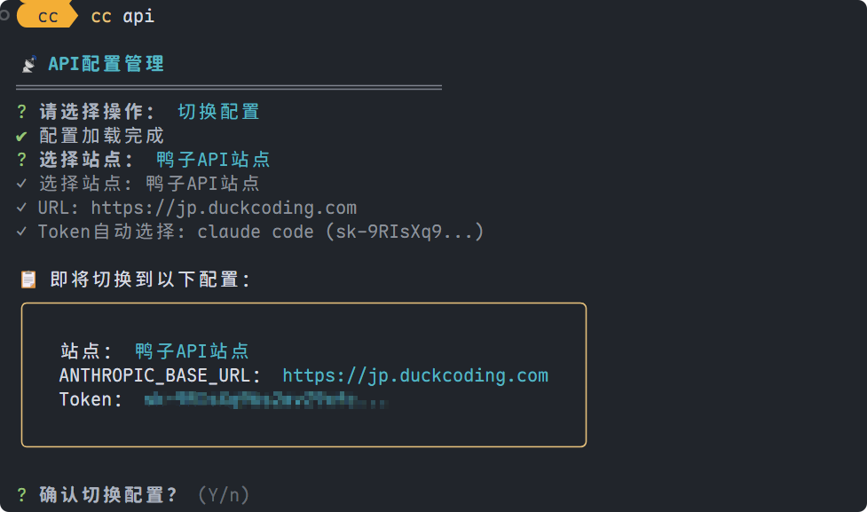

# CC CLI - Claude Code 配置管理 CLI 工具

[](https://www.npmjs.com/package/@cjh0/cc-cli)
[](https://www.npmjs.com/package/@cjh0/cc-cli)


CC CLI 是一个强大的命令行工具，专为 Claude Code 用户设计，用于管理和切换不同的 API 配置。支持智能配置合并，可将任何 Claude Code 配置无缝同步到 `settings.json`。

## ✨ 特性

- 🚀 **交互式界面** - 美观的命令行交互界面
- 🔄 **智能切换** - 快速切换不同的 API 站点和 Token
- 📋 **全功能管理** - 查看、添加、删除和管理 API 配置
- ⭐ **状态标识** - 清晰标识当前使用的配置
- 🤖 **智能选择** - 单选项自动选择，提升效率
- 📊 **统计信息** - 显示配置统计和使用状态
- 🔗 **智能合并** - 自动与 Claude Code `settings.json` 深度合并
- ⚙️ **全配置支持** - 支持 Claude Code 任何配置项，不仅限于 API 设置

## 📋 前提条件

- **Node.js** >= 14.0.0
- **Claude Code** - 需要已安装 [Claude Code](https://claude.ai/code)
- **API Token** - 拥有有效的 Anthropic API Token

## 📦 安装

### 全局安装

```bash
# npm
npm install -g @cjh0/cc-cli

# yarn
yarn global add @cjh0/cc-cli

# pnpm
pnpm install -g @cjh0/cc-cli
```

### 本地开发

```bash
git clone https://github.com/cjh-store/cc.git
cd cc

# 安装依赖
npm install    # 或 yarn install 或 pnpm install

# 创建全局链接用于测试
npm link       # 或 yarn link 或 pnpm link --global
```

## 🚀 使用方法

### 📸 界面预览

#### API 配置管理界面


#### 配置切换界面


### 基本命令

```bash
# 显示交互式主菜单
cc

# API配置管理
cc api

# 列出所有配置
cc api --list

# 添加新配置
cc api --add

# 删除配置
cc api --delete

# 查看当前状态
cc status

# 显示版本信息
cc --version
```

### 交互式菜单

运行 `cc` 命令会显示美观的交互式菜单：

```
╔══════════════════════════════════════╗
║     🚀 Claude Code CLI Tool v1.1.0   ║
╚══════════════════════════════════════╝

? 请选择功能模块： (Use arrow keys)
❯ 📡 API - API配置管理
  📊 Status - 查看当前状态
  ❓ Help - 帮助文档
  🚪 Exit - 退出
```

### API 配置管理

使用 `cc api` 进入 API 配置管理：

```
📡 API配置管理
════════════════════════════════════════

? 请选择操作： (Use arrow keys)
❯ 🔄 切换配置 - 切换API配置
  📋 查看配置 - 列出所有配置
  ➕ 添加配置 - 添加新的API配置
  🗑️  删除配置 - 删除API配置
  ⬅️  返回主菜单
```

## 📋 配置文件

### 核心功能：智能配置合并

CC CLI 的核心特性是**智能配置合并**。当你切换配置时，工具会自动将选中的配置与你现有的 `~/.claude/settings.json` 进行深度合并，确保所有设置都能无缝工作。

### 配置文件位置

- **主配置文件**: `~/.claude/api_configs.json` - 存储所有 API 配置
- **Claude Code 配置**: `~/.claude/settings.json` - Claude Code 主配置文件
- **当前配置**: `~/.claude/current_config.json` - 当前激活的配置
- **历史记录**: `~/.cc/history.json` - 配置切换历史

### 配置文件格式

`~/.claude/api_configs.json` 文件格式（支持完整的 Claude Code 配置）：

```json
{
  "sites": {
    "站点标识": {
      "url": "https://api.example.com",
      "description": "站点描述（可选）",
      "config": {
        "env": {
          "ANTHROPIC_BASE_URL": "https://api.example.com",
          "ANTHROPIC_AUTH_TOKEN": {
            "Token名称1": "sk-xxxxxxxxxxxxxxxxxxxxxxxx",
            "Token名称2": "sk-yyyyyyyyyyyyyyyyyyyyyyyy"
          },
          "CLAUDE_CODE_MAX_OUTPUT_TOKENS": "32000"
        },
        "model": "claude-3-5-sonnet-20241022"
      }
    }
  }
}
```

### 智能合并机制

当你选择一个配置时，CC CLI 会：

1. **读取当前 `settings.json`** - 保留你现有的所有设置
2. **深度合并配置** - 将选中站点的 `config` 部分与现有配置智能合并
3. **Token 精确替换** - `ANTHROPIC_AUTH_TOKEN` 使用你选中的具体 Token 值
4. **保留其他设置** - hooks、permissions、statusLine 等配置完全保留
5. **无缝切换** - Claude Code 立即生效新配置

## 🎯 智能选择功能

CC CLI 提供智能选择功能，提升使用效率：

- ✅ **Token 自动选择**: 当站点只有 1 个 Token 时，自动选择
- ⭐ **当前配置标识**: 使用 ⭐ 标识当前激活的配置
- 📊 **统计信息**: 显示站点、Token 数量统计
- 🔄 **智能合并**: 自动检测并合并 Claude Code 配置

## 📊 配置列表示例

```
📋 Claude API配置列表
════════════════════════════════════════
⭐ 当前配置: AnyRouter代理站点 > https://anyrouter.top > L站
════════════════════════════════════════

🌐 鸭子API站点 [InstCopilot API 多线路服务]
├─ 📡 ANTHROPIC_BASE_URL: https://jp.duckcoding.com
└─ 🔑 ANTHROPIC_AUTH_TOKEN (4个):
   ├─ 公司: sk-YDbBtY...J4hSe
   ├─ 家: sk-nWcKE7...j3hml
   ├─ 服务器: sk-oKuJqe...lkYTj
   └─ 测速专用: sk-MmD2gq...q6IpL

🌐 AnyRouter代理站点
├─ 📡 ANTHROPIC_BASE_URL: https://anyrouter.top
└─ 🔑 ANTHROPIC_AUTH_TOKEN (2个):
   ├─ L站: sk-v0Z0Mr...tP1v ⭐
   └─ Github: sk-yROymu...NGli

统计信息: 5个站点, 5个URL, 11个Token
```

## 🔥 核心优势

### 🎯 为什么选择 CC CLI？

1. **🔗 无缝集成** - 直接操作 Claude Code 配置，无需手动修改
2. **⚙️ 全配置支持** - 不仅支持 API 设置，还支持 hooks、permissions、statusLine 等所有配置
3. **🛡️ 安全可靠** - 智能合并机制，确保现有配置不丢失
4. **🚀 高效便捷** - 一键切换，立即生效，告别手动配置
5. **📱 用户友好** - 美观的交互界面，支持中英文站点名称

### 🔄 配置合并示例

**你的现有 `settings.json`：**

```json
{
  "env": {
    "CLAUDE_CODE_MAX_OUTPUT_TOKENS": "32000",
    "MCP_TIMEOUT": "30000"
  },
  "hooks": {
    "PreToolUse": [
      /* 你的hooks配置 */
    ]
  },
  "statusLine": {
    "type": "command",
    "command": "your-custom-statusline"
  }
}
```

**选择配置后自动合并为：**

```json
{
  "env": {
    "ANTHROPIC_BASE_URL": "https://anyrouter.top",
    "ANTHROPIC_AUTH_TOKEN": "sk-v0Z0MrSifA4TyUNC3BVVgH6Q0htQ2Q7lLv6T0TfXdN4ntP1v",
    "CLAUDE_CODE_MAX_OUTPUT_TOKENS": "32000",
    "MCP_TIMEOUT": "30000"
  },
  "hooks": {
    "PreToolUse": [
      /* 你的hooks配置保持不变 */
    ]
  },
  "statusLine": {
    "type": "command",
    "command": "your-custom-statusline"
  }
}
```

**✨ 关键特性：**

- ✅ API 配置自动更新
- ✅ 原有配置完全保留
- ✅ 深度智能合并
- ✅ 立即生效，无需重启

## 🛠️ 开发

### 项目结构

```
cc/
├── package.json              # npm配置文件
├── bin/
│   └── cc.js                # CLI入口文件
├── src/
│   ├── index.js             # 主程序入口
│   ├── commands/            # 命令模块目录
│   │   ├── index.js         # 命令注册中心
│   │   └── api/             # API功能模块
│   │       ├── index.js     # API命令主入口
│   │       ├── switch.js    # 切换配置功能
│   │       ├── list.js      # 列出配置功能
│   │       ├── add.js       # 添加配置功能
│   │       └── delete.js    # 删除配置功能
│   ├── core/                # 核心功能
│   │   └── ConfigManager.js # 配置文件管理类
│   └── utils/               # 工具函数
│       ├── ui.js           # UI美化工具
│       └── formatter.js    # 格式化工具
└── README.md              # 项目说明
```

### 本地测试

```bash
# 安装依赖
npm install    # 或 yarn install 或 pnpm install

# 创建全局链接
npm link       # 或 yarn link 或 pnpm link --global

# 测试基本功能
cc --help
cc api --help
cc api --list

# 取消全局链接
npm unlink     # 或 yarn unlink 或 pnpm unlink --global
```

## 📈 发布路线图

### 🎯 已完成功能 (v1.1.0)

- ✅ 🔄 **智能配置切换** - 支持 API 站点和 Token 切换
- ✅ 📋 **完整配置管理** - 查看、添加、删除配置
- ✅ 🔗 **智能合并系统** - 与 Claude Code settings.json 无缝合并
- ✅ ⚙️ **全配置支持** - 支持所有 Claude Code 配置项
- ✅ 🌏 **中英文支持** - 站点标识支持中英文
- ✅ 🎨 **美观交互界面** - 现代化命令行界面
- ✅ 🛡️ **安全删除机制** - 防误删保护和智能警告

### 🚀 未来规划

- [ ] 🔌 **插件系统** - 支持第三方插件扩展
- [ ] ☁️ **配置同步** - 云端配置同步功能
- [ ] 📊 **使用统计** - API 使用统计和分析
- [ ] 🔐 **安全增强** - Token 加密存储
- [ ] 📱 **移动端支持** - 移动设备配置管理

## 🤝 贡献

欢迎提交 Issue 和 Pull Request！

1. Fork 项目
2. 创建功能分支 (`git checkout -b feature/AmazingFeature`)
3. 提交更改 (`git commit -m 'Add some AmazingFeature'`)
4. 推送到分支 (`git push origin feature/AmazingFeature`)
5. 打开 Pull Request

## 📄 许可证

本项目基于 MIT 许可证开源 - 查看 [LICENSE](LICENSE) 文件了解详情。

## 🙏 致谢

- [Claude Code](https://claude.ai/code) - 强大的 AI 编程助手
- [Inquirer.js](https://github.com/SBoudrias/Inquirer.js) - 交互式命令行界面
- [Chalk](https://github.com/chalk/chalk) - 终端字符串样式
- [Boxen](https://github.com/sindresorhus/boxen) - 创建命令行框架

---

**CC CLI** - 让 Claude Code 配置管理变得简单高效！ 🚀

> 支持智能配置合并，一键切换 API 配置，无缝集成 Claude Code 生态系统
